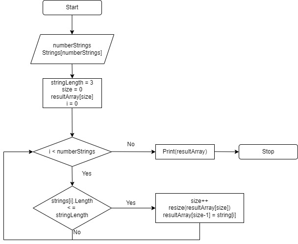

# Описание рещения

1. Исходный массив и длина требуемых строк вводятся пользователем. Ввод обрабатывается методом ***InputArray()***, где сначала при помощи метода ***InputInt()*** вводится длина массива ***numberStrings***, а затем, используя метод ***InputString()***, последовательно в исходный массив записываются его элементыю

2. Поиск требуемых элементов осуществляется методом ***FindStringByLength()***. Создается результирующий массив ***resultArray*** нулевой длины, так как неизвестно, сколько найдется элементов. В цикле длины элементов исходного массива сравниваются с требуемой длиной. Если длина строки меньше или равна ***stringLength***, то при помощи метода ***Array.Resize()***, увеличивается длина выходного массива, а в его последний эллемент записывается текущая строка входного.

3. Для вывода в консоль исходного и результирующего массивов используется метод ***PrintStringArray()***, где методом ***string.Join()*** создается строка из элементов массива, а для удобства чтения к этой строке добавляется оформление.